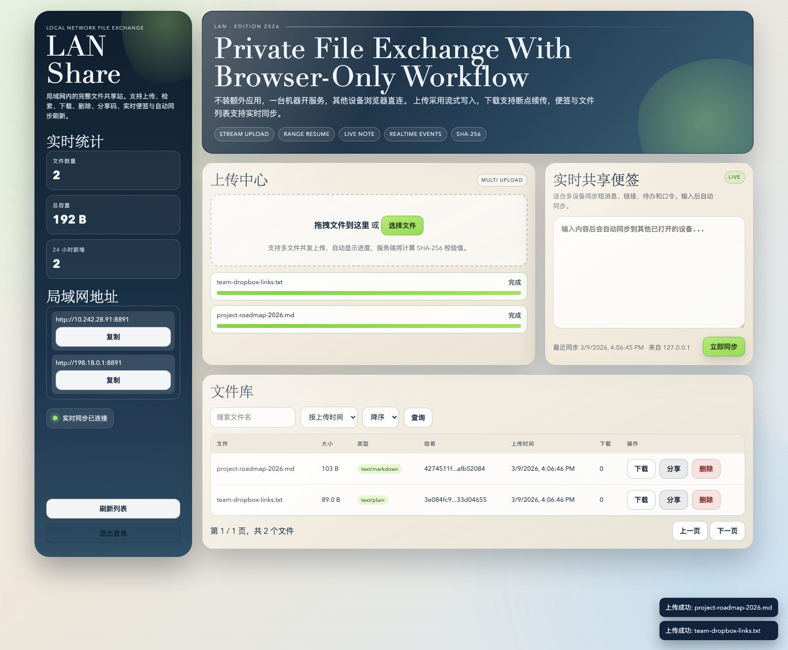
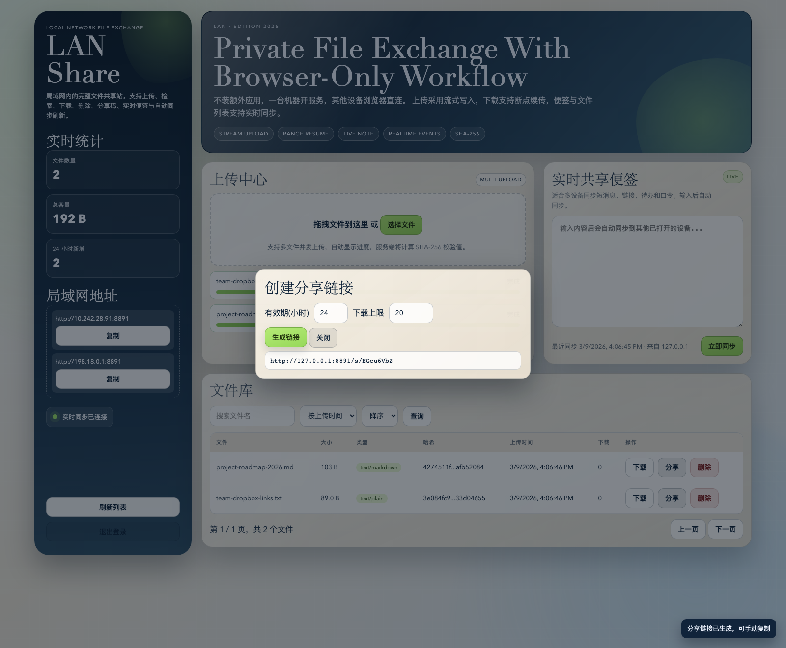

# LAN Share Complete

> A browser-first LAN file sharing service for Mac and PC, built with Python standard library only.
>
> One device starts `server.py`, every other device opens a browser. No desktop client, no extra dependency stack.

[详细说明文档（中文）](docs/DETAILED_GUIDE.zh-CN.md)

## Preview

| Main workspace | Share link flow |
| --- | --- |
|  |  |
| Upload center, live note, LAN address panel, stats, and searchable file library in one page. | Share link generation with expiration window and download limit controls. |

## Why This Repo Is Useful

This project targets a very practical workflow:

- one machine inside the LAN hosts the service
- every other device joins from a browser
- files stay on the host machine instead of a third-party cloud
- the whole product is still comfortable to use, not just a raw directory listing

Compared with a temporary transfer script, this repo already includes authentication, metadata management, share codes, resumable downloads, live updates, and a polished browser UI.

## Code-Verified Highlights

After reading the full codebase, these are the core behaviors implemented today:

- Password login with `HttpOnly` cookie session
- In-memory session expiration with configurable lifetime
- Login throttling after repeated failed attempts
- Streamed upload pipeline with temporary `.part` files and SHA-256 checksum generation
- Chunked request body handling for large uploads
- File library with search, pagination, sort by time / size / name / downloads
- Download endpoint with HTTP `Range` support for resume workflows
- Soft delete in SQLite plus physical file cleanup on disk
- Share links with expiration time and max-download limits
- Public share landing page at `/s/<code>`
- Shared note synced across devices
- Server-Sent Events for live file list and note refresh
- LAN address discovery so the host can quickly tell other devices where to connect

## Product Model

Only one machine needs to run the app:

- Device A: runs `python3 server.py`
- Device B / C / phone / tablet: opens `http://DeviceA-IP:8765`
- Logged-in devices can upload, download, delete, create share links, and update the shared note in real time

In practice, it behaves more like a lightweight private LAN portal than a peer-to-peer desktop application.

## Tech Stack

- Backend: a single `server.py` using `http.server`, `sqlite3`, `hashlib`, `secrets`, and other Python standard library modules
- Frontend: plain `HTML`, `CSS`, and `JavaScript` in `web/`
- Storage: SQLite metadata in `data/lan_share.db` and file blobs in `uploads/`
- Realtime: SSE over `GET /api/events`

There is no framework dependency and no package installation step in the repo itself.

## Quick Start

### 1. Clone the repository

```bash
git clone git@github.com:nihaoyaxiaofei/lan-share-complete.git
cd lan-share-complete
```

### 2. Start the server

```bash
python3 server.py
```

On first launch, the server prints:

- local address, such as `http://127.0.0.1:8765`
- LAN address, such as `http://192.168.x.x:8765`
- admin password, such as `Admin Password: xxxxx`

If `LAN_SHARE_PASSWORD` is not set, the password is auto-generated and stored in `data/admin_password.txt`.

### 3. Open it from another device

Make sure both devices are on the same LAN, then open:

```text
http://<server-lan-ip>:8765
```

### 4. Log in and start transferring

After login, you can:

- drag files into the page to upload
- watch upload progress in the browser
- browse the shared file library
- download with resume support
- create expiring share links
- edit the shared note and watch it sync live on other devices

## Common Workflows

### Two laptops transfer files

- Laptop A runs the server
- Laptop B opens the LAN URL in a browser
- Either side uploads to the shared space
- Both sides see updates without refreshing the whole page

### Temporary team dropbox on office Wi-Fi

- one machine hosts during a meeting or workshop
- everyone joins through a browser
- files can be exchanged without installing a client

### Shared text board across devices

- use the live note for links, snippets, Wi-Fi info, or short handoff messages
- note updates propagate through SSE to all connected clients

## Configuration

The server can be configured with environment variables.

| Variable | Default | Description |
| --- | --- | --- |
| `LAN_SHARE_HOST` | `0.0.0.0` | Listen address |
| `LAN_SHARE_PORT` | `8765` | Server port |
| `LAN_SHARE_PASSWORD` | auto-generated | Admin password |
| `LAN_SHARE_MAX_MB` | `4096` | Max upload size in MB |
| `LAN_SHARE_SESSION_HOURS` | `24` | Session lifetime in hours |
| `LAN_SHARE_DATA_DIR` | `./data` | Metadata directory |
| `LAN_SHARE_UPLOAD_DIR` | `./uploads` | File storage directory |

Example:

```bash
LAN_SHARE_PORT=9000 \
LAN_SHARE_PASSWORD='YourStrongPass' \
LAN_SHARE_MAX_MB=8192 \
python3 server.py
```

## API Surface

- `POST /api/login`
- `POST /api/logout`
- `GET /api/me`
- `GET /api/network`
- `GET /api/stats`
- `GET /api/events`
- `GET /api/note`
- `POST /api/note`
- `GET /api/files`
- `POST /api/upload?filename=...`
- `GET /api/files/:id/download`
- `DELETE /api/files/:id`
- `POST /api/files/:id/share`
- `GET /api/public/:code/download`
- `GET /s/:code`

For `curl` examples and implementation notes, see [详细说明文档（中文）](docs/DETAILED_GUIDE.zh-CN.md).

## Implementation Notes

These details come directly from the current code, which helps set correct expectations for contributors and users:

- Sessions are kept in memory, so restarting the server clears active logins.
- Login protection currently locks an IP after 6 failed attempts for 90 seconds.
- Uploads are written to temporary files first and moved into place only after completion.
- Download resume support is implemented through single-range HTTP responses.
- Deleted files are hidden from listings and removed from disk, while metadata keeps a soft-delete marker.
- Share downloads increment both share counters and the file's total download count.
- The shared note is limited to 20,000 characters.

## Project Structure

```text
lan-share-complete/
  server.py
  README.md
  docs/
    DETAILED_GUIDE.zh-CN.md
    assets/
  web/
    index.html
    styles.css
    app.js
  data/
  uploads/
```

## Security Notes

This project is designed for trusted LAN environments.

- Use a strong password through `LAN_SHARE_PASSWORD`
- Do not expose it directly to the public internet
- If internet access is required, put it behind HTTPS and an access-control layer
- Stop the service when it is no longer needed

## Roadmap

- resumable uploads for very large files
- QR code generation for faster mobile access
- multi-user roles and permission scopes
- reverse proxy / HTTPS deployment guide

